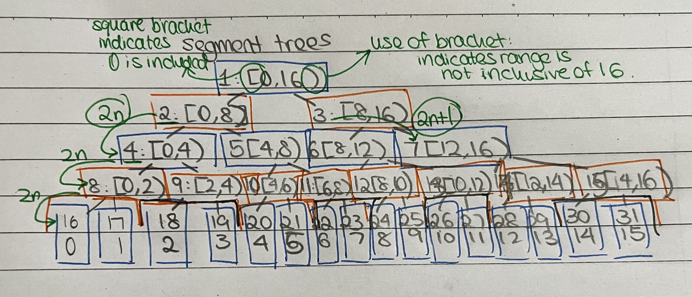

# Segment Trees
A segment tree is a data structure that stores information about array intervals in its nodes. This allows efficient answering of range queries and updates
- **Key Operations:** Build, Query, Update.

# Building a segment tree
<figure style="text-align: center;">
  
  <figcaption>Figure 1: Example of a Segment Tree</figcaption>
</figure>


## Example Problem
Given an array, find the sum of elements in a range and update values efficiently.

### Code Implementation
```cpp
#include<bits/stdc++.h>
using namespace std;
...
